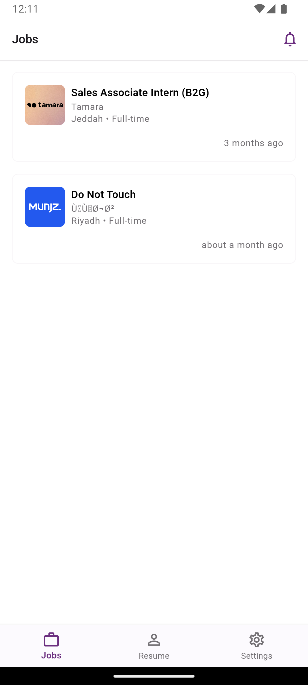
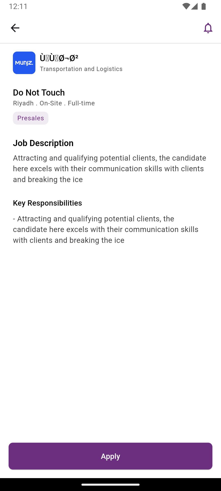

# Job Listing App

This project is a Flutter application that displays a list of job openings and their details. It follows the Clean Architecture principle to ensure separation of concerns and maintainability.

## Project Architecture

The project follows Clean Architecture, which is divided into three main layers:

1. **Domain Layer**: Contains the core business logic and rules of the application.
   - `entities`: Define the core objects of the application.
   - `repositories`: Define abstract classes for data operations.
   - `usecases`: Contain the application-specific business rules.

2. **Data Layer**: Responsible for data retrieval and storage.
   - `models`: Define how the data is structured for storage and transfer.
   - `datasources`: Implement the actual data retrieval logic.
   - `repositories`: Implement the repository interfaces defined in the domain layer.

3. **Presentation Layer**: Handles the UI and user interactions.
   - `pages`: Contain the main screens of the application.
   - `widgets`: Reusable UI components.
   - `bloc`: Manage the state and business logic of the UI.

## Tools and Packages

1. **Flutter**: The main framework used for building the cross-platform application.

2. **Dart**: The programming language used for developing Flutter applications.

3. **flutter_bloc**: A state management library that helps implement the BLoC (Business Logic Component) pattern.
   - Version: ^8.0.0
   - Usage: Manages the state of the UI and business logic.

4. **get_it**: A simple Service Locator for Dart and Flutter projects.
   - Version: ^7.2.0
   - Usage: Handles dependency injection throughout the app.

5. **dartz**: Functional programming in Dart.
   - Version: ^0.10.0
   - Usage: Provides Either type for error handling.

6. **equatable**: A Dart package that helps to implement value equality without needing to explicitly override == and hashCode.
   - Version: ^2.0.0
   - Usage: Simplifies equality comparisons for classes.

7. **freezed**: ^2.3.2

## Getting Started

1. Ensure you have Flutter installed on your machine.
2. Clone this repository.
3. Run `flutter clean` to clean builds
4. Run `flutter pub get` to install dependencies.
5. Run `dart run build_runner build --delete-conflicting-outputs` to generat freezed models
6. Run `flutter run` to start the application.

## Testing

The project is set up for both unit and widget testing. To run the tests, use the following command:

```
flutter test
```

## Screenshots

Job Listing Screen             |  Job Details Screen
:-------------------------:|:-------------------------:
 |  
